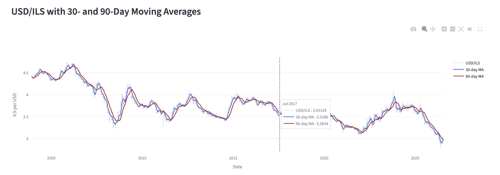
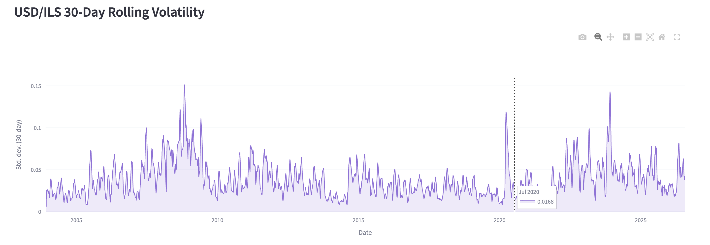
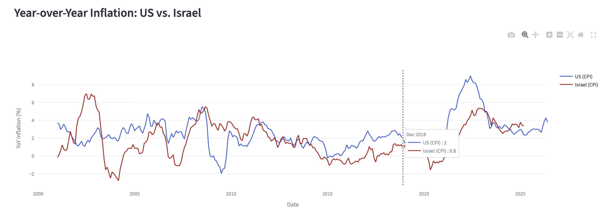
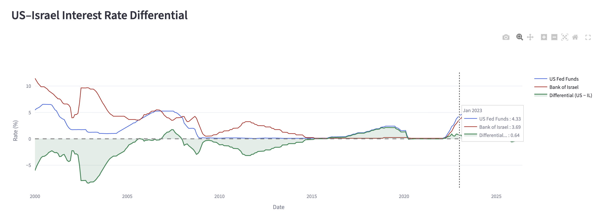
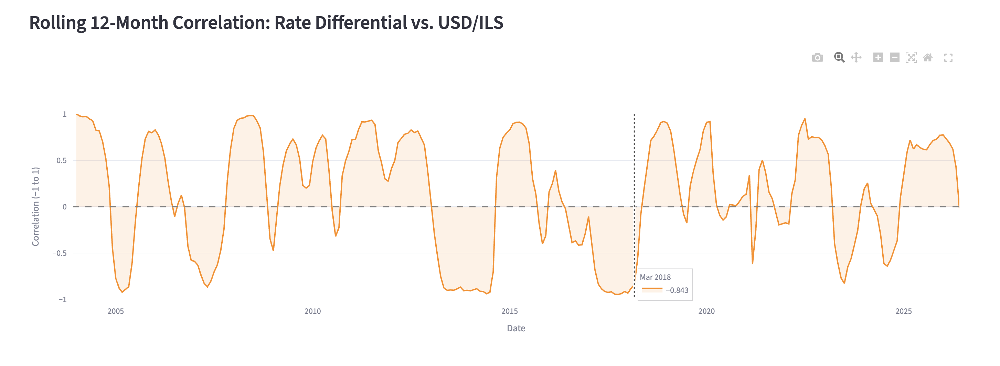

# USD/ILS Macro Analysis

A PostgreSQL-backed data pipeline and interactive dashboard exploring the relationship between US and Israeli macroeconomic conditions and the USD/ILS exchange rate. The project ingests data from multiple public sources into a normalized relational schema, applies analytical SQL (window functions and CTEs) to answer specific economic questions, and visualizes the results in a five-panel Streamlit dashboard.

## Overview

The core question motivating the project: **how do interest-rate differentials, inflation, and market volatility relate to the USD/ILS exchange rate over time?** Rather than treat this as a single model, the project builds the pieces — the exchange rate, the two countries' inflation, the rate differential — and then quantifies how tightly they actually move together, finding that the relationship is time-varying rather than constant.

## Tech stack

- **PostgreSQL** — normalized relational database
- **Python** (pandas, SQLAlchemy) — ETL pipeline
- **SQL** — analytical layer (window functions, CTEs, aggregate correlation)
- **Streamlit + Plotly** — interactive dashboard

## Data sources

Seven time series are ingested from three different sources, demonstrating a multi-source pipeline:

| Series | Source | Frequency |
| --- | --- | --- |
| US CPI (all urban consumers) | FRED (`CPIAUCSL`) | Monthly |
| US core CPI (ex food & energy) | FRED (`CPILFESL`) | Monthly |
| US federal funds rate | FRED (`FEDFUNDS`) | Monthly |
| US 10-year Treasury yield | FRED (`DGS10`) | Daily |
| Israel CPI | FRED / OECD (`ISRCPIALLMINMEI`) | Monthly |
| Bank of Israel policy rate | FRED / OECD (`IRSTCI01ILM156N`) | Monthly |
| USD/ILS exchange rate | yfinance (`ILS=X`) | Daily |

All series are pulled from 2000 onward (the daily FX series begins in December 2003, its earliest available date).

## Database schema

The database uses a normalized star-style design that separates the *description* of each series from its *observations*:

```
countries ──< indicators ──< observations
```

- **`countries`** — dimension table (US, Israel)
- **`indicators`** — catalog of each series (code, name, country, frequency, units, source)
- **`observations`** — fact table holding every data point, keyed on `(indicator_id, obs_date)`

A foreign key from `observations` to `indicators`, and from `indicators` to `countries`, enforces referential integrity. The composite primary key on `observations` prevents duplicate observations and supports idempotent re-loading. See [`sql/schema.sql`](sql/schema.sql).

## Analytical queries

Each dashboard panel is powered by a distinct SQL query in [`sql/`](sql/), chosen to demonstrate a different technique:

1. **Year-over-year inflation** (`LAG` + `PARTITION BY`) — computes 12-month inflation from raw CPI index levels for both countries in a single query, using `PARTITION BY` so the window resets per country.
2. **Interest rate differential** (multiple CTEs + join) — pulls the US and Israeli policy rates into separate CTEs and joins them by date to compute the spread.
3. **Rolling FX statistics** (window frames) — 30- and 90-day moving averages and 30-day rolling volatility on the daily exchange rate, using `ROWS BETWEEN n PRECEDING AND CURRENT ROW`.
4. **Rolling correlation** (`date_trunc` + rolling `CORR`) — aggregates daily FX to monthly with `date_trunc`, joins it to the monthly rate differential, and computes a rolling 12-month correlation between the two.

## Dashboard

The Streamlit app ([`app.py`](app.py)) presents five panels.

**USD/ILS exchange rate with 30- and 90-day moving averages**



**USD/ILS 30-day rolling volatility**



**Year-over-year inflation: US vs. Israel**



**US–Israel interest rate differential**



**Rolling 12-month correlation between the rate differential and the exchange rate**



## Key finding

The rolling correlation between the interest-rate differential and the exchange rate is **not stable** — it swings between strongly positive and strongly negative across different periods. This suggests that while rate differentials are one driver of the exchange rate, the relationship strengthens and breaks down over time, and the differential is one factor among many. The project is framed as an exploration of this relationship rather than a claim of causation.

## Running locally

```bash
# 1. Set up the database
createdb usd_ils_macro
psql usd_ils_macro -f sql/schema.sql

# 2. Set credentials as environment variables
export FRED_API_KEY="your_fred_api_key"
export DB_PASSWORD="your_postgres_password"

# 3. Ingest the data (see the ingestion notebook)
#    Runs the FRED, yfinance, and OECD pulls and loads them into Postgres

# 4. Launch the dashboard
pip install -r requirements.txt
streamlit run app.py
```

## Notes and limitations

- Israeli CPI (OECD-sourced) lags the other series, ending in early 2025; the US series run to mid-2026.
- The Bank of Israel and CBS publish native APIs (SDMX format); this project uses OECD-sourced equivalents via FRED for reliability, with the native APIs noted as a possible future improvement.
- Rolling windows are measured in observations (trading days for daily series, months for monthly), following standard financial convention.

## Possible extensions

- Deploy the dashboard with a cloud-hosted database (e.g. Neon, Supabase) for a public link
- Add native Bank of Israel / CBS API ingestion
- Add interactive date-range and indicator controls to the dashboard
